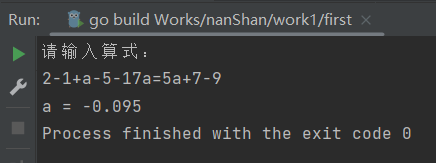
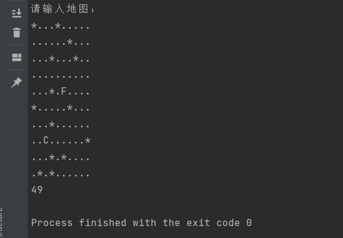
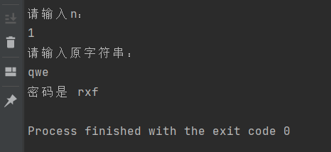

蓝山入门作业   
**第一题：**  
&emsp;1.main包仅仅是函数调用，tool内包含所有的逻辑代码。  
&emsp;2.将解方程的步骤划分为三大步，分别为获取数据(newMaths())，移项(move())，和计算(calculate())，每一个被输入的数据都会被转化为math类型的数据，以便计算。  
&emsp;3.运行结果示意图：  
&emsp;&emsp;

**第二题：**  
&emsp;1.main包同样是函数的调用，logic包内包含所有的逻辑  
&emsp;2.终止条件暂定为移动10000步（没有想到更好的）  
&emsp;3.运行结果示意图  
  
**第三题：**  
&emsp;直接偏移即可  
  